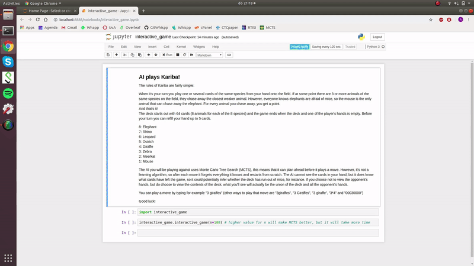

# Artificial Intelligence learns to play Kariba!
Python implementation of Multiple-Observer Information Set Monte Carlo Tree Search (MOISMCTS) for the card game Kariba, as described in [this blog](http://www.linktoblog.com).

To play a game of Kariba against an AI using MOISMCTS, visit interactive_game.ipynb. From the command line:
```python
    jupyter notebook
```


MOISMCTS keeps track of a separate tree per player. A node in this tree is not a state, but an 'information set'; the set of all states the game could be in given the information that the player has. A player cannot observe the opponent's hand, but it can reason about which hands are either in the deck or in the opponents hand. These cards are in the 'jungle', the union of the deck and the opponent's hand(s). The tree distinguishes between pre-action-nodes, post-action-nodes and a neutral-nodes. We only keep track of the amount of simulated wins from post-action-nodes onwards, because only for those nodes do we need to compute the upper confidence bound (UCB) (which requires the amount of wins).

```python
>>> from kariba_moismcts import Kariba, moismcts, Simulators, Node
...
... kariba = Kariba()
... event = kariba.random_card_draw() # actions and card draws are both 'events', represented as a dictionary
... kariba.apply_event(event)
... root_state = kariba
... best_action = moismcts(root_state, n=100)
... 
... print(kariba)
... print(event)
... print(best_action)
```

    100%|██████████| 100/100 [00:00<00:00, 154.62it/s]

    -------------------------
    turn: player0
    deck:
    [7 8 8 8 6 8 6 8]
    field:
    [0 0 0 0 0 0 0 0]
    hands:
    player0 [1 0 0 0 2 0 2 0]
    player1 [0 0 0 0 0 0 0 0]
    -------------------------
    
    {'kind': 'deck_draw', 'who': 'player0', 'cards': array([1, 0, 0, 0, 2, 0, 2, 0])}
    {'kind': 'action', 'who': 'player0', 'cards': array([0, 0, 0, 0, 0, 0, 2, 0])}


    


```python
# what happens inside the moismcts function
>>> simulators = Simulators(root_state)
... 
... simulators.apply_event(simulators.select_action())
... simulators.next_turn()
... simulators.apply_event(simulators.random_card_draw()) # draw cards for player0
... 
... print("Complete information of the state:")
... print(simulators.game)
... 
... print("Partial information available to player0:")
... print(Node(simulators.game, "player0"))
... 
... print("Partial information available to player1:")
... print(Node(simulators.game, "player1"))
```

    Complete information of the state:
    -------------------------
    turn: player1
    deck:
    [6 8 7 7 6 7 5 8]
    field:
    [0 0 0 0 0 0 1 0]
    hands:
    player0 [1 0 0 0 2 0 1 0]
    player1 [1 0 1 1 0 1 1 0]
    -------------------------
    
    Partial information available to player0:
    +------------------------
    neutral_node
    self: player0
    n: 0
    jungle:
    [7 8 8 8 6 8 6 8]
    field:
    [0 0 0 0 0 0 1 0]
    hand:
    [1 0 0 0 2 0 1 0]
    
    Partial information available to player1:
    +------------------------
    pre_action_node
    self: player1
    n: 0
    jungle:
    [7 8 7 7 8 7 6 8]
    field:
    [0 0 0 0 0 0 1 0]
    hand:
    [1 0 1 1 0 1 1 0]
    


```python
# run n simulations
>>> n = 6
... 
... simulators = Simulators(root_state)
... for _ in range(n):
...     while not simulators.game.is_final:
...         simulators.apply_event(simulators.random_card_draw()) # give cards to the player whose turn it is, at the very first turn, this should not do anything
...         simulators.apply_event(simulators.select_action()) # the player whose turn it is may select the action, apply the action to the game and update both the players' trees
...         simulators.next_turn()
...     winner = simulators.game.leading_player
...     simulators.backpropagate(winner)
...     simulators.reset_game()
...     
... print("Tree of player0 after "+str(n)+" simulations:")
... print(simulators.tree_dict["player0"])
... 
... print("Tree of player1 after "+str(n)+" simulations:")
... print(simulators.tree_dict["player1"])
```

    Tree of player0 after 6 simulations:
    +------------------------
    neutral_node
    self: player0
    n: 6
    jungle:
    [7 8 8 8 6 8 6 8]
    field:
    [0 0 0 0 0 0 1 0]
    hand:
    [1 0 0 0 2 0 1 0]
        +------------------------
        neutral_node
        self: player0
        n: 2
        jungle:
        [7 8 7 8 6 8 6 8]
        field:
        [0 0 1 0 0 0 1 0]
        hand:
        [1 0 0 0 2 0 1 0]
            +------------------------
            pre_action_node
            self: player0
            n: 1
            jungle:
            [7 8 7 8 6 7 6 8]
            field:
            [0 0 1 0 0 0 1 0]
            hand:
            [1 0 0 0 2 1 1 0]
            
        +------------------------
        neutral_node
        self: player0
        n: 1
        jungle:
        [7 8 8 8 6 8 5 8]
        field:
        [0 0 0 0 0 0 2 0]
        hand:
        [1 0 0 0 2 0 1 0]
        
        +------------------------
        neutral_node
        self: player0
        n: 1
        jungle:
        [7 8 8 7 6 8 6 8]
        field:
        [0 0 0 1 0 0 1 0]
        hand:
        [1 0 0 0 2 0 1 0]
        
        +------------------------
        neutral_node
        self: player0
        n: 1
        jungle:
        [6 8 8 8 6 8 6 8]
        field:
        [1 0 0 0 0 0 1 0]
        hand:
        [1 0 0 0 2 0 1 0]
        
        +------------------------
        neutral_node
        self: player0
        n: 1
        jungle:
        [7 8 8 8 6 7 6 8]
        field:
        [0 0 0 0 0 1 1 0]
        hand:
        [1 0 0 0 2 0 1 0]
        
    Tree of player1 after 6 simulations:
    +------------------------
    pre_action_node
    self: player1
    n: 6
    jungle:
    [7 8 7 7 8 7 6 8]
    field:
    [0 0 0 0 0 0 1 0]
    hand:
    [1 0 1 1 0 1 1 0]
        +------------------------
        post_action_node
        self: player1
        n: 2
        w: 1
        jungle:
        [7 8 7 7 8 7 6 8]
        field:
        [0 0 1 0 0 0 1 0]
        hand:
        [1 0 0 1 0 1 1 0]
            +------------------------
            neutral_node
            self: player1
            n: 1
            jungle:
            [7 8 7 7 8 7 5 8]
            field:
            [0 0 1 0 0 0 2 0]
            hand:
            [1 0 0 1 0 1 1 0]
            
        +------------------------
        post_action_node
        self: player1
        n: 1
        w: 1
        jungle:
        [7 8 7 7 8 7 6 8]
        field:
        [0 0 0 0 0 0 2 0]
        hand:
        [1 0 1 1 0 1 0 0]
        
        +------------------------
        post_action_node
        self: player1
        n: 1
        w: 0
        jungle:
        [7 8 7 7 8 7 6 8]
        field:
        [0 0 0 1 0 0 1 0]
        hand:
        [1 0 1 0 0 1 1 0]
        
        +------------------------
        post_action_node
        self: player1
        n: 1
        w: 0
        jungle:
        [7 8 7 7 8 7 6 8]
        field:
        [1 0 0 0 0 0 1 0]
        hand:
        [0 0 1 1 0 1 1 0]
        
        +------------------------
        post_action_node
        self: player1
        n: 1
        w: 0
        jungle:
        [7 8 7 7 8 7 6 8]
        field:
        [0 0 0 0 0 1 1 0]
        hand:
        [1 0 1 1 0 0 1 0]
        
